

  

<h1 align="center">CAPSU Student Portal</h1>

Official download page for the <strong>CAPSU Student Portal</strong> Android application.

  

---
## Overview

The CAPSU Student Portal provides students with convenient access to academic information and university services through a mobile application.
The application is designed to be user-friendly and
easy to use, allowing students to access important information.
## Preview

## Screenshots

  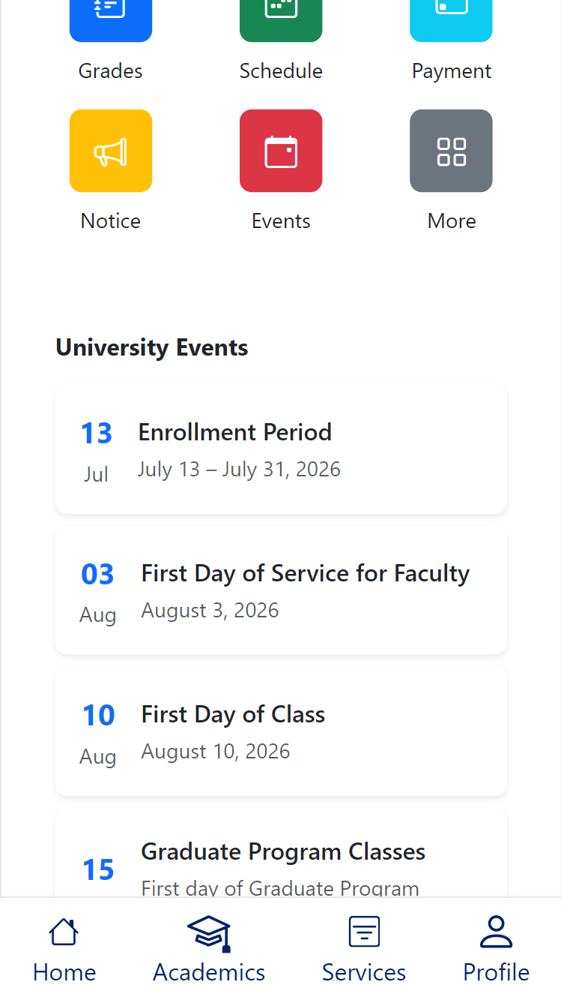
  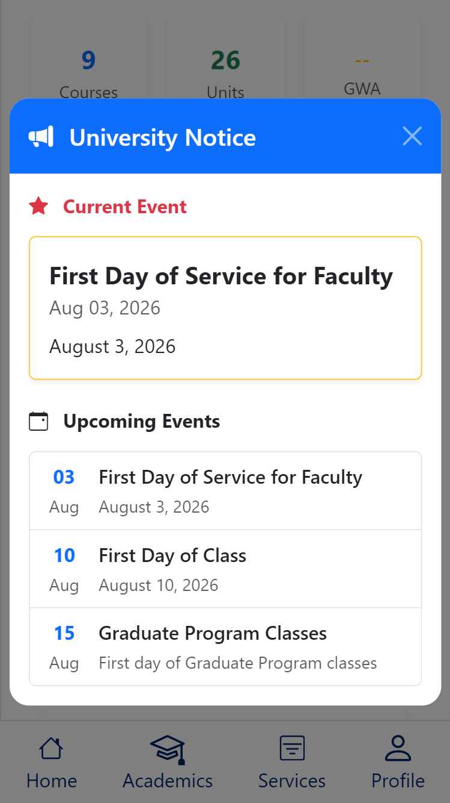
  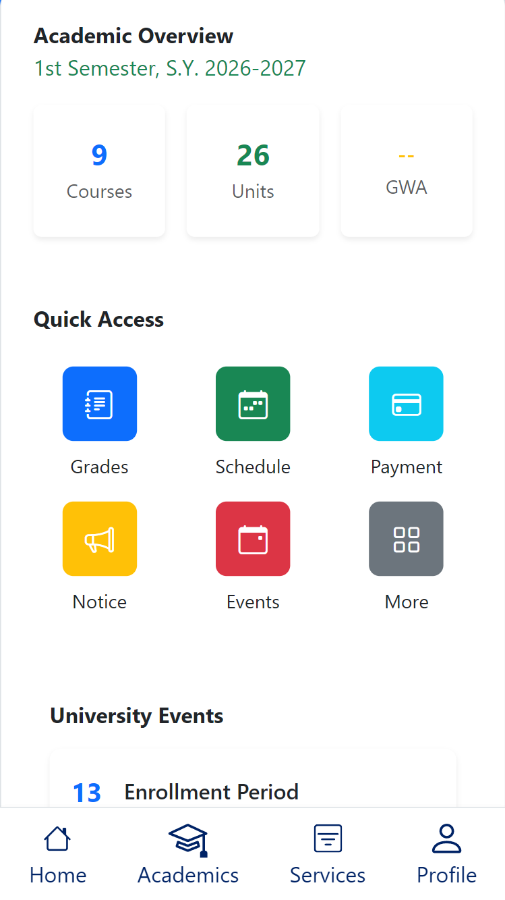

  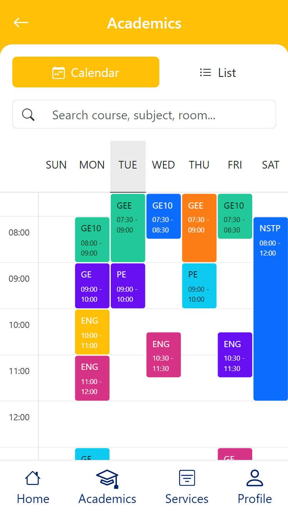
  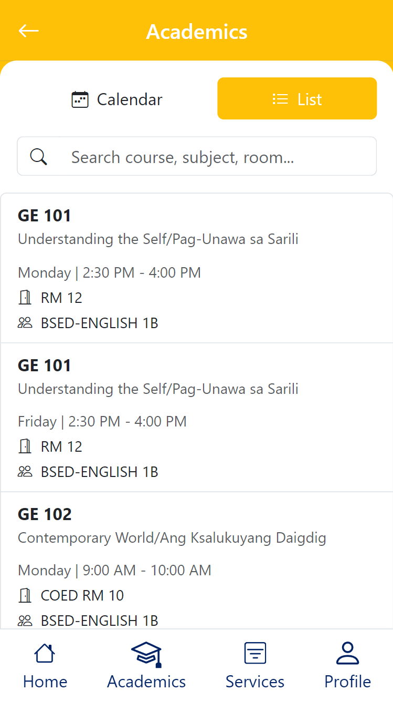
  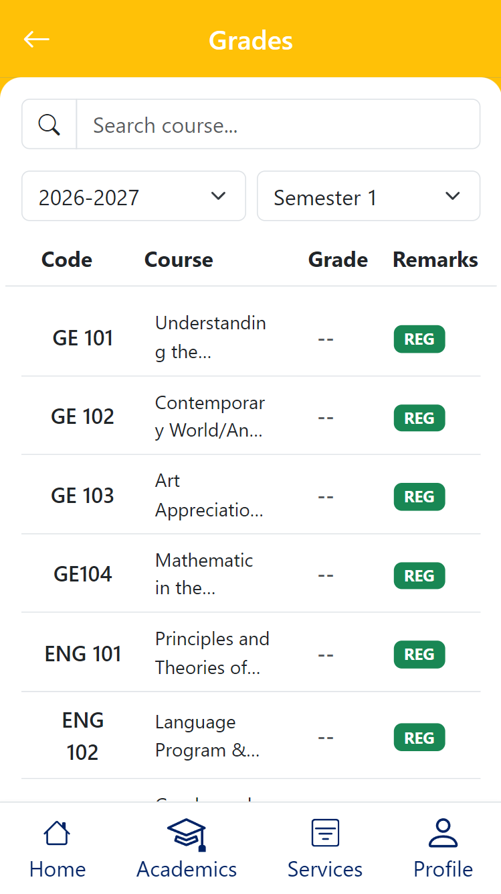

  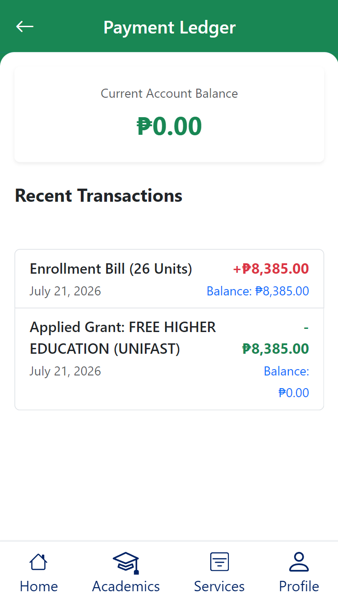
  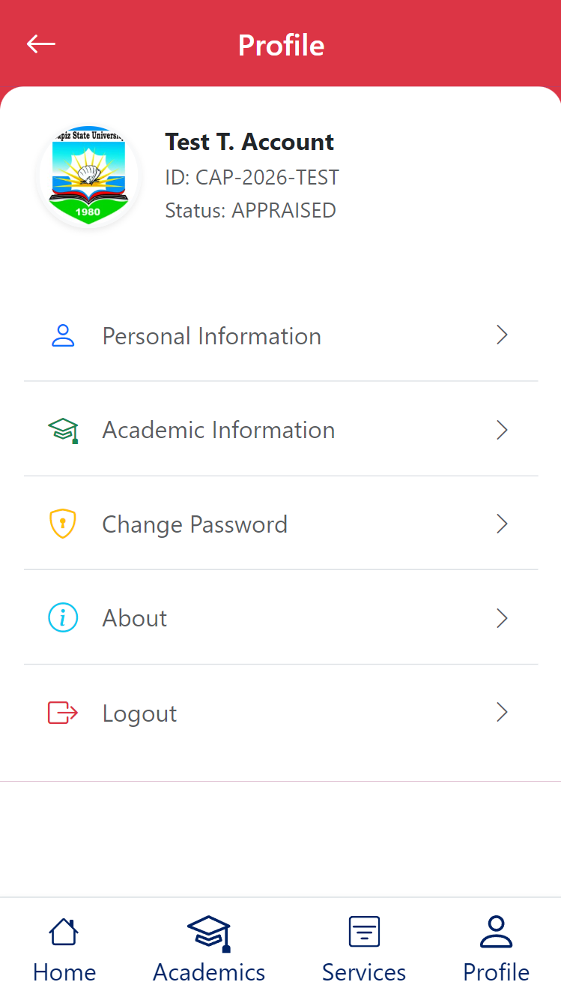
  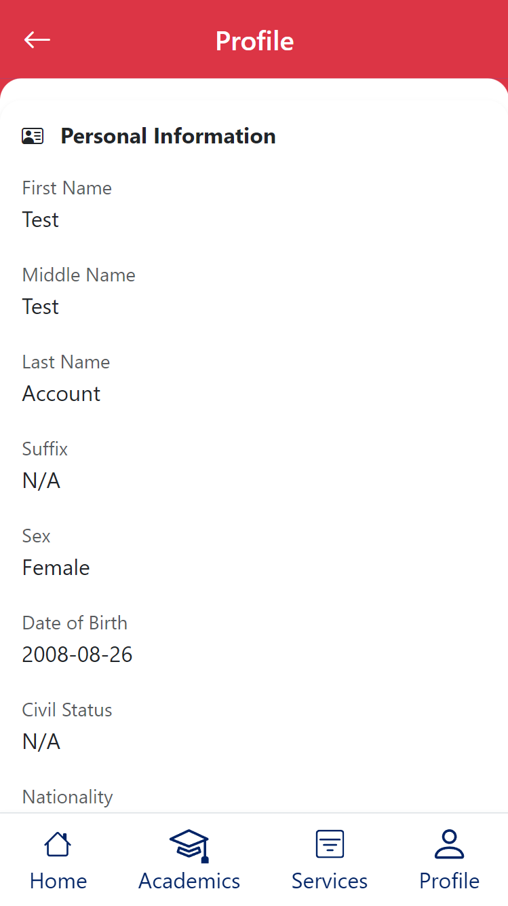

  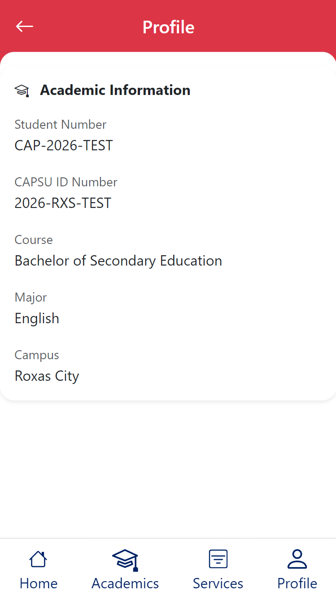
  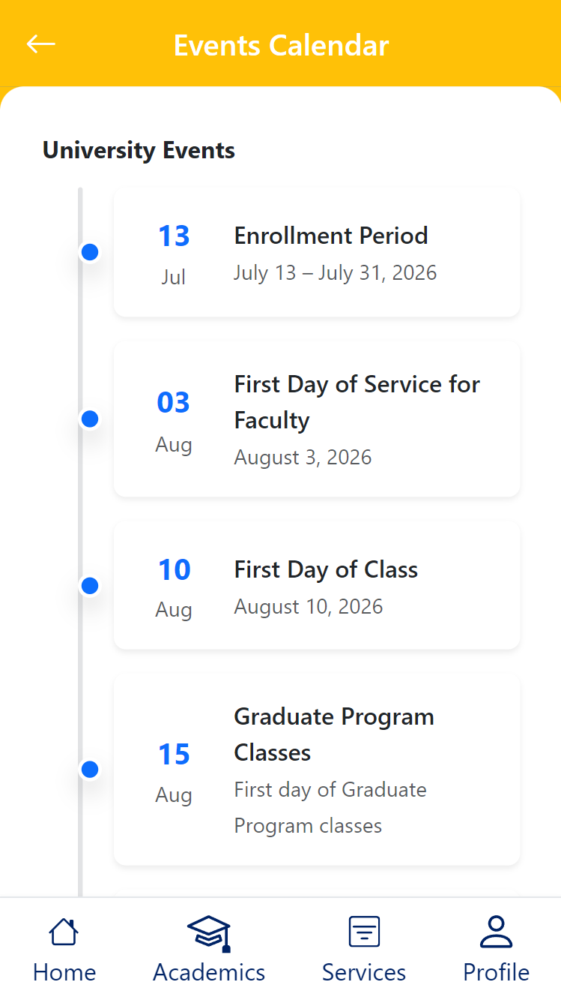
  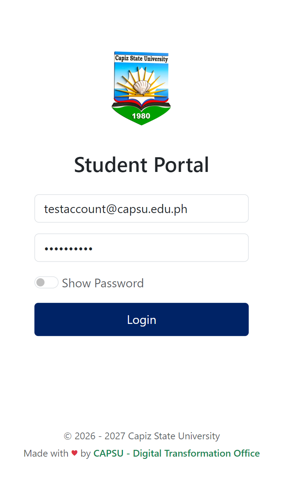

### Video Demo

> Click the image below to watch the demo.

  <a href="https://youtu.be/IzWFd1C7qEQ" style="font-size:20vw;">
    ▶️
  </a>

---

## Features

- Student Dashboard
- Class Schedule
- Grades
- School Calendar
- University Events
- Student Profile
- Announcements
- Quick Access Services

## Download

Visit the official download page:

👉 https://capsu-dev.github.io/student_portal/

Download the latest Android application (.apk) directly from the website.

## Test App

This application is an unsigned APK intended for manual and automated testing, verification, and validation purposes only.

## Requirements

- Android 8.0 (Oreo) or later
- Internet connection
- Active CAPSU Student Portal account

## Installation

1. Download the latest APK.
2. Open the downloaded APK.
3. Allow installation from unknown sources if prompted.
4. Install the application.
5. Sign in using your CAPSU Student Portal credentials.

## Updates

Always download the latest version from the official website to receive new features, bug fixes, and security improvements.

## Privacy

Student information is securely handled through the official CAPSU Student Portal services.

## Developer

**Capiz State University**  
Digital Transformation Office

---

© 2026–2027 Capiz State University. All Rights Reserved.